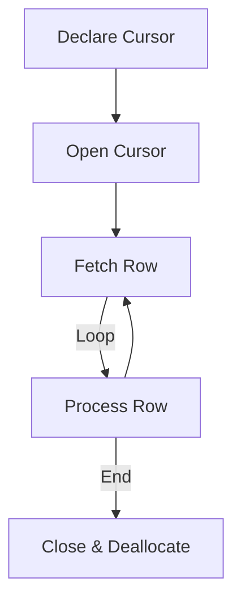

## Introduction
T-SQL (Transact-SQL) is a powerful programming language used in Microsoft SQL Server for managing and processing data. It includes tools like **variables**, **control-of-flow structures**, **stored procedures**, **triggers**, **functions**, **cursors**, and **common table expressions (CTEs)** to enhance performance and readability.

---

### A - T-SQL Variables


> [!Info] Variables | Introduction
> - زي اي لغة برمجه الT-SQL فيها متغيرات بنعرفها عن طريق DECLARE وعشان نخزن فيها قيمه اما بنستخدم SET او SELECT وهنوضح كل التفاصيل والفرق ما بينهم تحت
> 
> - وزي اي متغير بيبقي ليه Scope , ال Scope بتاع المتغير هنا بيبقي جوا ال Patch او المكان الي بتكتب فيه ال Queries
> 
> - ال Data types هنا هيا نفسها الي موجوده في الsql فمش محتاجين نشرحها 

#### 1️⃣ Declaring a Variable
Use the `DECLARE` keyword to define a variable:
- **Syntax**: `DECLARE @VariableName DataType;`
- **Example**:  
  ```sql
  DECLARE @MyName NVARCHAR(50);
  DECLARE @Counter INT;
  ```

#### 2️⃣ Assigning a Value to a Variable
##### 1. Using `SET`
Assign a single value directly:
`SET @Counter = 10;`

##### 2. Using `SELECT`
Assign a value from a query result:
`SELECT @Counter = COUNT(*) FROM Students;`

> ⚠️ **Difference between `SET` and `SELECT`:**
> - `SET`: Preferred for assigning a single value. It's more explicit and safer.
> - `SELECT`: Can assign values from a query, and allows multiple assignments at once.  
>     But if the query returns multiple rows:
>     - `SELECT` assigns the last row silently.
>     - `SET` throws an error.

#### 3️⃣ Special Variables
- Start with `@@` (built-in/global variables):
  - `@@ERROR`: Returns the error number from the last T-SQL statement. Returns `0` if no error.
  - `@@ROWCOUNT`: Number of rows affected by the last statement (e.g., `SELECT`, `INSERT`, `UPDATE`).
  - `@@IDENTITY`: Returns the last identity value inserted in the current session and scope.

#### 4️⃣ Common Use Cases for Variables
- Temporarily storing query results.
- Counters or flags in loops (`WHILE`).
- Conditional logic (`IF`, `CASE`, etc.).
- Parameter manipulation inside stored procedures or scripts.

---

### B - Control-of-Flow Structures

#### 1️⃣ `IF` Statements


> [!Info] IF | Introduction
> - كالعاده برده زي اي لغة ال T-SQL فيها if statements وزيها بالظبط زي اي لغة تانية مع اختلاف بسيط في السينتاكس وهنوضح تحت ازاي نستفيد منها واحنا بنكتب queries

##### Syntax
```sql
IF condition
BEGIN
    -- Statements to run if condition is TRUE
END
ELSE
BEGIN
    -- Statements to run if condition is FALSE
END
```
- Used for conditional logic and branching.
- Keep logic simple for better readability.

##### 🔍 Examples
###### Example 1: Basic IF
```sql
DECLARE @age INT = 20;
IF @age >= 18
BEGIN
    PRINT 'You are an adult.';
END
ELSE
BEGIN
    PRINT 'You are a minor.';
END
```

###### Example 2: Nested `IF`
```sql
DECLARE @score INT = 85;
IF @score >= 90
    PRINT 'Grade A';
ELSE
    IF @score >= 80
        PRINT 'Grade B';
    ELSE
        PRINT 'Grade C or lower';
```

###### Example 3: Logical Operators with IF
You can use:
- `AND` / `OR` / `NOT`
- `EXISTS`

**Example with `EXISTS`:**
```sql
IF EXISTS (SELECT 1 FROM Employees WHERE Name = 'John')
BEGIN
    PRINT 'Employee exists.';
END
```

###### Example 4: Error Handling with `IF` + `@@ERROR`
```sql
DECLARE @ErrorValue INT;
INSERT INTO Employees (Name) VALUES ('Nour Eldeen');
SET @ErrorValue = @@ERROR;
IF @ErrorValue <> 0
BEGIN
    PRINT 'An error occurred with error number: ' + CAST(@ErrorValue AS VARCHAR);
    -- Additional error handling logic
END
```

> ✅ Check `@@ERROR` **immediately** after the statement you want to validate.

#### 2️⃣ `CASE` Statement


> [!Info] Case | Introduction
> - ودي زيها زي ال Switch الي موجوده في اغلب لغات البرمجه
> - نقدر نستخدم جملة `CASE` في جملة `SELECT` بشكل واسع جدًا، وده الاستخدام الأشهر ليها.
> - ونقدر كمان نستخدم `CASE` مع أوامر DML (زي `INSERT`, `UPDATE`, `DELETE`) 


The CASE statement in T-SQL provides a flexible way to perform conditional logic within queries, similar to a switch statement in other programming languages. It can be used in `SELECT`, `UPDATE`, `ORDER BY`, and other clauses to categorize data or apply dynamic modifications.

##### Simple CASE Syntax
```sql
CASE expression
WHEN value1 THEN result1
WHEN value2 THEN result2
[ELSE default_result]
END
```
- **Description**: Compares an expression against a set of values and returns the corresponding result.
- **Notes**: The ELSE clause is optional; if omitted, NULL is returned for unmatched cases.

##### 🔍 Examples
###### Example 1: Simple CASE
```sql
SELECT
    DepartmentID,
    CASE DepartmentID
    WHEN 1 THEN 'HR'
    WHEN 2 THEN 'Marketing'
    ELSE 'Other'
    END AS DepartmentName
FROM Employees;
```
- **Explanation**: Maps DepartmentID values to department names ('HR' for 1, 'Marketing' for 2, 'Other' for all others). The result is aliased as DepartmentName.

###### Example 2: CASE in UPDATE Statements (Conditional Data Modification)
```sql
UPDATE Employees2
SET Salary = CASE
    WHEN PerformanceRating > 90 THEN Salary * 1.15
    WHEN PerformanceRating BETWEEN 75 AND 90 THEN Salary * 1.10
    WHEN PerformanceRating BETWEEN 50 AND 74 THEN Salary * 1.05
    ELSE Salary
END;
```
- **Explanation**: Adjusts salaries based on PerformanceRating:
    - Increases by 15% if rating > 90.
    - Increases by 10% if rating is 75-90.
    - Increases by 5% if rating is 50-74.
    - No change otherwise (ELSE Salary).

###### Example 3: Nested CASE with Aggregation
```sql
SELECT
    PerformanceCategory,
    COUNT(*) AS NumberOfEmployees,
    AVG(Salary) AS AverageSalary
FROM
    (SELECT
        Name,
        Salary,
        CASE
            WHEN PerformanceRating >= 80 THEN 'High'
            WHEN PerformanceRating >= 60 THEN 'Medium'
            ELSE 'Low'
        END AS PerformanceCategory
    FROM Employees2) AS PerformanceTable
GROUP BY PerformanceCategory;
```
- **Explanation**:
    1. **Inner Query**: Creates a derived table PerformanceTable by:
        - Selecting Name and Salary.
        - Using CASE to categorize PerformanceRating into 'High' (≥80), 'Medium' (≥60), or 'Low' (<60).
    2. **Outer Query**: Groups by PerformanceCategory and calculates:
        - COUNT(*) for the number of employees.
        - AVG(Salary) for the average salary per category.
    3. **Result**: Summarizes employee count and average salary by performance category.

##### Use Cases
- **Categorizing Values in SELECT**: Assign labels or groups to data (e.g., performance categories).
- **Conditional Logic Inside Queries**: Apply dynamic transformations based on conditions.
- **Dynamic Sorting with ORDER BY**: Sort results based on conditional logic.
- **Applying Logic in UPDATE/INSERT**: Modify data conditionally (e.g., salary adjustments).

#### 3️⃣ `WHILE` Loops

> [!Info] Loops | Introduction
> - في ال T-SQL مفيش `For`,`Do-While` , فيه بس ال `While` وبتشتغل بنفس الطريقه زي اي لغة تانية مع اختلاف السينتاكس طبعا

##### Syntax
```sql
WHILE condition
BEGIN
    -- Statements to repeat
END
```
- Loop continues **as long as the condition is TRUE**.
- You can control the loop with `BREAK` and `CONTINUE`.

##### 🔍 Examples
###### Example 1 – Basic Counter Loop
```sql
DECLARE @Counter INT = 1;
WHILE @Counter <= 5
BEGIN
    PRINT 'Count: ' + CAST(@Counter AS VARCHAR);
    SET @Counter = @Counter + 1;
END
```
**Explanation:**  
Prints numbers from 1 to 5. Increments the counter each time.
```sql
Output
Count: 1
Count: 2
Count: 3
Count: 4
Count: 5
```

###### Example 2 – Countdown
```sql
DECLARE @Counter INT = 5;
WHILE @Counter >= 0
BEGIN
    PRINT 'Count: ' + CAST(@Counter AS VARCHAR);
    SET @Counter = @Counter - 1;
END
```
**Explanation:**  
Counts down from 5 to 0. Decreases the value each loop.

###### Example 3 – Loop with `IF` and `BREAK`
```sql
DECLARE @Balance DECIMAL(10,2) = 950;
DECLARE @Withdraw DECIMAL(10,2) = 100;
WHILE @Balance > 0
BEGIN
    IF @Balance >= @Withdraw
    BEGIN
        SET @Balance = @Balance - @Withdraw;
        PRINT 'Balance: ' + CAST(@Balance AS VARCHAR);
    END
    ELSE
    BEGIN
        PRINT 'Insufficient funds';
        BREAK;
    END
END
```
**Explanation:**  
Simulates a withdrawal process. If balance is too low, prints a warning and exits using `BREAK`.

###### Example 4 – Iterating Over Table Rows (Manually)
```sql
DECLARE @EmployeeID INT;
DECLARE @EmployeeName NVARCHAR(50);
DECLARE @MaxID INT;
SELECT @EmployeeID = MIN(EmployeeID) FROM Employees;
SELECT @MaxID = MAX(EmployeeID) FROM Employees;
WHILE @EmployeeID IS NOT NULL AND @EmployeeID <= @MaxID
BEGIN
    SELECT @EmployeeName = Name FROM Employees
    WHERE EmployeeID = @EmployeeID;
    PRINT @EmployeeName;
    SELECT @EmployeeID = MIN(EmployeeID) FROM Employees
    WHERE EmployeeID > @EmployeeID;
END
```
**Explanation:**  
Prints each employee’s name by looping through their IDs manually. Useful when you want to simulate row-by-row processing.

##### Common Use Cases for `WHILE`
| Use Case                | Description                        |
|--------------------------|------------------------------------|
| Basic counters          | Loop through numbers / iterations  |
| Data processing         | Iterate through table rows manually|
| Conditional termination | Exit loop when a condition is no longer valid |
| Simulations or calculations | Perform repeated operations like totals, etc. |
| Nested loops            | Build matrices or complex reports  |

##### ⚠️ Notes & Tips
- T-SQL **does not** support `FOR` or `DO...WHILE` loops — only `WHILE`.
- Use `BREAK` to **exit the loop early**.
- Use `CONTINUE` to **skip to the next iteration**.
- Loops can become **slow** with large datasets — prefer **set-based operations** when possible.

---

### 📌 C - Transactions in T-SQL

> [!NOTE] Transactions | Introduction
>-  لو عندك أوامر كتير في السيستم زي إنك تخصم من حساب عميل وتحط في حساب تاني، وعايز كلهم يتنفذوا مرة واحدة، ومينفعش واحد منهم يفشل والباقي يتنفذ، ساعتها بنستخدم حاجة اسمها **Transaction**.
>- طب ازاي بتشتغل ؟ 
>	- أي مجموعة أوامر جوه الترانزكشن لازم كلها تتنفذ مع بعض.
>	- لو كله تمام  بنعمل **COMMIT** يعني نثبت التغييرات.
>	- لو حصلت مشكلة في أي أمر → بنعمل **ROLLBACK** ونرجّع كل حاجة زي ما كانت.

#### What is a Transaction?
A **transaction** is a group of one or more SQL operations that are executed together as a **single unit**.  
It ensures that **either all operations succeed or none do** — this maintains **data integrity**.

##### Syntax
```sql
BEGIN TRANSACTION;
-- SQL operations here...
IF @@ERROR <> 0
    ROLLBACK TRANSACTION;
ELSE
    COMMIT TRANSACTION;
```

##### Example – Simple Transfer
```sql
BEGIN TRANSACTION;
-- Deduct from sender
UPDATE Accounts
SET Balance = Balance - 500
WHERE AccountID = 1;
-- Add to receiver
UPDATE Accounts
SET Balance = Balance + 500
WHERE AccountID = 2;
-- Error check
IF @@ERROR <> 0
    ROLLBACK;
ELSE
    COMMIT;
```
📝 **Explanation:**  
- Ensures both updates succeed together.
- If one fails, changes are rolled back.

##### ACID Properties
| Property    | Meaning                              |
|-------------|--------------------------------------|
| Atomicity   | All operations succeed or none do.   |
| Consistency | Database stays valid before & after. |
| Isolation   | Transactions don't interfere with each other. |
| Durability  | Once committed, changes survive system failures. |

##### 📌 Use Cases
- Bank transfers
- Inventory updates
- Order processing
- Logging operations

##### ⚠️ Tips
- Always handle errors (`@@ERROR` or `TRY...CATCH`).
- You can nest transactions, but only the **outermost** one commits.
- Use `ROLLBACK` to undo, `COMMIT` to finalize.

---

### D - Stored Procedures in T-SQL

> [!NOTE] Stored Procedures | Introduction
>  - ال Stored Procedures هيا Method تقدر تكتب جواها اي حاجة انته عايزها تتنفذ وبتبقي Optimized واسرع من انك تكتب من غير Stored Procedures لانها بتكون Pre Compiled
>  - غير السرعه ال Stored Procedures بتوفرلك reusability بدل ما تكتب الكويري او الكود اكتر من مره تقدر تعرف Stored Procedure وتناديها لما تحتاجها 

#### 🔹 What is a Stored Procedure?
A **Stored Procedure (SP)** is a saved block of T-SQL code that can be executed on demand.  
It acts like a **method/function in programming**, used to encapsulate logic, automate tasks, and manage data access securely and efficiently.

##### Benefits of Stored Procedures
- **Performance**: Precompiled and cached by SQL Server.
- **Security**: Restricts direct table access.
- **Reusability**: Use the same logic in multiple places.
- **Maintainability**: Centralizes business logic.
- **Reduces network traffic**: Only the call is sent, not the whole SQL query.

##### Syntax
```sql
CREATE PROCEDURE ProcedureName
    @Param1 DataType,
    @Param2 DataType = DefaultValue
AS
BEGIN
    -- T-SQL statements
END
```
🔹 **Execution:**
```sql
EXEC ProcedureName @Param1 = value1, @Param2 = value2;
```

##### 🌟 Examples
###### Example 1 - Insert with Validation
**🔹 Use Case:** Ensure that data is valid (e.g., no duplicates) before inserting it into the database.
```sql
CREATE PROCEDURE AddCustomer
    @Name NVARCHAR(50),
    @Email NVARCHAR(100)
AS
BEGIN
    IF EXISTS (SELECT 1 FROM Customers WHERE Email = @Email)
    BEGIN
        PRINT 'Email already exists.';
        RETURN;
    END
    INSERT INTO Customers (Name, Email) VALUES (@Name, @Email);
END
```
**🧠 Explanation:**  
This procedure checks if the email already exists before inserting a new customer. It helps avoid duplicate entries and enforces business rules.

###### Example 2 - Filtered Data Retrieval
**🔹 Use Case:** Return specific records based on user input, such as generating reports or loading filtered data in apps.
```sql
CREATE PROCEDURE GetOrdersByCustomer
    @CustomerID INT
AS
BEGIN
    SELECT * FROM Orders WHERE CustomerID = @CustomerID;
END
```
**🧠 Explanation:**  
This procedure takes a customer ID and returns all related orders. It’s commonly used in reporting tools or web applications.

###### Example 3 – Using Output Parameters in a Stored Procedure
**🔹 Use Case**: Return the total number of orders for a specific customer.
```sql
CREATE PROCEDURE GetOrderCount
    @CustomerID INT,
    @TotalOrders INT OUTPUT
AS
BEGIN
    SELECT @TotalOrders = COUNT(*)
    FROM Orders
    WHERE CustomerID = @CustomerID;
END
```

###### Example 4 - Transactional Operation
**🔹 Use Case:** Execute multiple related operations as one atomic unit — either all succeed or none.
```sql
CREATE PROCEDURE TransferFunds
    @FromID INT,
    @ToID INT,
    @Amount DECIMAL(10,2)
AS
BEGIN
    BEGIN TRANSACTION;
    UPDATE Accounts SET Balance = Balance - @Amount WHERE AccountID = @FromID;
    UPDATE Accounts SET Balance = Balance + @Amount WHERE AccountID = @ToID;
    COMMIT;
END
```
**🧠 Explanation:**  
This procedure performs a money transfer between two accounts. Using a transaction ensures that both updates happen together — or not at all.

###### Example 5 - Error Handling with TRY...CATCH
**🔹 Use Case:** Catch and handle SQL errors inside procedures instead of crashing or returning bad results.
```sql
CREATE PROCEDURE SafeDelete
    @ProductID INT
AS
BEGIN
    BEGIN TRY
        DELETE FROM Products WHERE ProductID = @ProductID;
    END TRY
    BEGIN CATCH
        PRINT 'Error: ' + ERROR_MESSAGE();
    END CATCH
END
```

##### Key Features You Can Use Inside SP
- `SELECT`, `INSERT`, `UPDATE`, `DELETE`
- Input / Output parameters
- `IF...ELSE`, `WHILE`, `TRY...CATCH`
- `BEGIN TRANSACTION / COMMIT / ROLLBACK`
- `sp_executesql` for **dynamic SQL**
- **Temporary tables** and **table variables**
- Nested procedure calls
- **SCOPE_IDENTITY()** for returning last inserted ID

---

### 📌 E - Functions in T-SQL

> [!NOTE] Functions Introduction
> - ال Function شبه ال Stored Procedure بس الفرق ان ال Stored Procedure منقدرش نستخدمها جوه الquery بعكس الfunction 
> - الFunction كمان بتكون read only يعني بتستخدم مع ال select بس منقدرش نستخدم فيها insert , update 

#### 🔹 1. Scalar Functions
##### What They Are:
- Return **a single scalar value** (e.g., int, string).
- Used **in SELECT, WHERE, ORDER BY**, etc.
- **Read-only** (can't perform INSERT/UPDATE).

##### 🧪 Example 1 - Average Grade by Subject
```sql
CREATE FUNCTION dbo.GetAverageGrade(@Subject NVARCHAR(50))
RETURNS INT
AS
BEGIN
    DECLARE @avg INT;
    SELECT @avg = AVG(Grade) FROM Students WHERE Subject = @Subject;
    RETURN @avg;
END;
```
##### Usage:
`SELECT Name, dbo.GetAverageGrade(Subject) AS AvgGrade FROM Teachers;`

#### 🔹 2. Inline Table-Valued Functions (ITVF)
##### ✅ What They Are:
- Return a **table** from a **single SELECT statement**.
- Can be used in `FROM`, `JOIN`, subqueries, etc.
- Also **read-only**.

##### Example 2 - Get Students by Subject
```sql
CREATE FUNCTION dbo.GetStudentsBySubject(@Subject NVARCHAR(50))
RETURNS TABLE
AS
RETURN (
    SELECT * FROM Students WHERE Subject = @Subject
);
```
##### Usage:
`SELECT * FROM dbo.GetStudentsBySubject('Math');`

#### 🔹 3. Multi-Statement Table-Valued Functions (MTVF)
##### ✅ What They Are:
- Return a table like ITVFs, but with **multiple steps or statements**.
- Can define the table structure with `@Result TABLE`.
- Still **read-only**.

##### Example: Get Top 3 Students
```sql
CREATE FUNCTION dbo.GetTopPerformingStudents()
RETURNS @Result TABLE (
    StudentID INT,
    Name NVARCHAR(50),
    Subject NVARCHAR(50),
    Grade INT
)
AS
BEGIN
    INSERT INTO @Result
    SELECT TOP 3 StudentID, Name, Subject, Grade
    FROM Students
    ORDER BY Grade DESC;
    RETURN;
END;
```
##### Usage:
`SELECT * FROM dbo.GetTopPerformingStudents();`

##### 📊 Comparison: Functions vs Stored Procedures
| Feature                         | Scalar Function | ITVF  | MTVF  | Stored Procedure         |
|---------------------------------|-----------------|-------|-------|--------------------------|
| Returns                         | Single value    | Table | Table | Any (none, scalar, sets) |
| Used in SELECT/WHERE            | ✅ Yes           | ✅ Yes | ✅ Yes | ❌ No (must EXEC)         |
| Can be called inside a query    | ✅               | ✅     | ✅     | ❌                        |
| Supports multiple statements    | ❌               | ❌     | ✅     | ✅                        |
| Can modify data (INSERT/UPDATE) | ❌               | ❌     | ❌     | ✅                        |
| Can return multiple result sets | ❌               | ❌     | ❌     | ✅                        |
| Supports output parameters      | ❌               | ❌     | ❌     | ✅                        |
| Deterministic & read-only       | ✅               | ✅     | ✅     | ❌ (can change DB)        |

##### ✅ When to Use What?
- **Use Scalar Function**: For returning calculated values like grades, bonuses, etc.
- **Use ITVF**: When returning filtered or joined datasets via a single `SELECT`.
- **Use MTVF**: When logic needs **multiple steps** but should return a table.
- **Use Stored Procedure**: When logic includes **data manipulation**, **transactions**, or **complex control flow**.

---

### 📌 F - T-SQL Ranking Functions – Explained with Example

#### 🧠 What are Ranking Functions?
Ranking functions assign a number to each row based on the specified order.  
They are used with `OVER (ORDER BY ...)`, and sometimes `PARTITION BY` to reset ranks in groups.

##### 📊 Example Table: Employees
| EmployeeID | Name    | Department | Salary |
|------------|---------|------------|--------|
| 1          | Alice   | HR         | 5000   |
| 2          | Bob     | IT         | 7000   |
| 3          | Charlie | IT         | 7000   |
| 4          | Diana   | HR         | 4500   |
| 5          | Ethan   | IT         | 4000   |

##### 🔎 Query Using All 4 Ranking Functions:
```sql
SELECT Name, Salary,
       ROW_NUMBER() OVER (ORDER BY Salary DESC) AS RowNum,
       RANK() OVER (ORDER BY Salary DESC) AS RankNum,
       DENSE_RANK() OVER (ORDER BY Salary DESC) AS DenseRank,
       NTILE(3) OVER (ORDER BY Salary DESC) AS Tile
FROM Employees;
```

##### 📈 Output Explained:
| Name    | Salary | RowNum | RankNum | DenseRank | Tile |
|---------|--------|--------|---------|-----------|------|
| Bob     | 7000   | 1      | 1       | 1         | 1    |
| Charlie | 7000   | 2      | 1       | 1         | 1    |
| Alice   | 5000   | 3      | 3       | 2         | 2    |
| Diana   | 4500   | 4      | 4       | 3         | 2    |
| Ethan   | 4000   | 5      | 5       | 4         | 3    |

##### 📌 Explanation:
- **🔹 `ROW_NUMBER()`**: Always gives a unique number (1, 2, 3, ...). No matter if values repeat.
- **🔹 `RANK()`**: Same values share the **same rank**. Next rank is **skipped** (gaps happen). Here: Bob & Charlie get **1**, then Alice gets **3**.
- **🔹 `DENSE_RANK()`**: Same as `RANK()` but **no gaps**. Bob & Charlie get **1**, Alice gets **2**, Diana gets **3**.
- **🔹 `NTILE(n)`**: Divides rows into **n groups** (3 in this case). 5 rows → groups of 2, 2, 1.

##### 💡 Notes:
- Use `PARTITION BY` if you want to restart the ranks per group (e.g., per department).
- `ROW_NUMBER()` is great for pagination.
- `NTILE()` is ideal for **quartiles**, **deciles**, or dividing users by score groups.
- `RANK()`/`DENSE_RANK()` useful in competitions or ordering by performance.

---

### 📌 G - Triggers in T-SQL

> [!Info] Triggers | Introduction
> - ال Trigger بشكل عام هو ايفنت بيحصل في وقت معين (حسب نوع الTrigger) وفيه نوعين منه , `After` , `Instead Of` وكل واحد فيهم بيستخدم مع  ( `INSERT`, `UPDATE`, `DELETE`)

#### What are Triggers?
Triggers in T-SQL are special stored procedures automatically executed in response to specific database events, such as `INSERT`, `UPDATE`, or `DELETE` operations. They are defined at the table or view level and consist of three key components: **Trigger Event**, **Trigger Condition**, and **Trigger Action**.

##### Types of Triggers
1. **After Triggers**: Execute after the triggering event (e.g., `INSERT`, `UPDATE`, `DELETE`) completes. Used for auditing, logging, or updating related data.
2. **Instead Of Triggers**: Execute instead of the triggering event, overriding the default action. Useful for custom logic, view updates, or soft deletes.

##### Special Tables
- **inserted**: Contains new or updated rows during `INSERT` or `UPDATE`.
- **deleted**: Contains old rows during `UPDATE` or `DELETE`.

##### 🌟 Examples
###### Example 1 - Auditing New Records (AFTER INSERT)
**🔹 Use Case:** Log every new student added to the `Students` table for auditing purposes.
```sql
CREATE TRIGGER trg_AuditInsert ON Students
AFTER INSERT
AS
BEGIN
    INSERT INTO StudentLog (StudentID, Name)
    SELECT StudentID, Name FROM inserted;
END;
```
**🧠 Explanation:**  
Whenever a new row is inserted into `Students`, the trigger inserts a copy into `StudentLog`.  
This helps track who was added and when — useful for security or audit trails.

###### Example 2 - Soft Deletes (INSTEAD OF DELETE)
**🔹 Use Case:** Instead of deleting records, mark them as inactive by updating a column.
```sql
ALTER TABLE Students ADD IsActive BIT DEFAULT 1;
CREATE TRIGGER trg_SoftDelete ON Students
INSTEAD OF DELETE
AS
BEGIN
    UPDATE Students
    SET IsActive = 0
    FROM deleted
    WHERE Students.StudentID = deleted.StudentID;
END;
```
**🧠 Explanation:**  
This prevents actual deletion of data. Instead, it sets `IsActive = 0`, keeping the row in the table.  
Great for historical data tracking and compliance.

###### Example 3 - Updating a View (INSTEAD OF UPDATE)
**🔹 Use Case:** Make a view that combines multiple tables editable by intercepting update actions.
```sql
CREATE TRIGGER trg_UpdateStudentView ON StudentView
INSTEAD OF UPDATE
AS
BEGIN
    UPDATE PersonalInfo
    SET Name = I.Name
    FROM inserted I
    WHERE PersonalInfo.StudentID = I.StudentID;
    UPDATE AcademicInfo
    SET Grade = I.Grade
    FROM inserted I
    WHERE AcademicInfo.StudentID = I.StudentID;
END;
```
**🧠 Explanation:**  
Standard `UPDATE` statements on complex views don’t work directly.  
This `INSTEAD OF` trigger allows controlled updates to the underlying base tables of the view.

##### Notes
- **Performance**: Triggers can impact performance; use judiciously and test thoroughly.
- **Complexity**: Avoid overly complex logic; prefer set-based operations.
- **Maintenance**: Monitor and document triggers to avoid unintended side effects.

---

### 📌 H - Cursors in T-SQL

> [!Info] Cursors | Introduction
> ال Cursor هو حاجة بتخليك تلف علي كل الداتا الي في الجدول كلها بس مشكلته ان ال Performance بتاعه وحش جدا عشان كده المفروض منستخدموش غير لما ميبقاش فيه حل غيره

#### What is a Cursor?
A **cursor** is a database object that allows **row-by-row processing** of a result set.

> Unlike a normal `SELECT` which handles **sets**, a cursor lets you **loop** through rows **one at a time**.

##### When to Use Cursors?
- When you need to apply **complex logic per row**.
- If row-by-row processing is **unavoidable**.
- For **migrating**, **logging**, or **transforming** data row-wise.
⚠ Prefer **set-based operations** when possible – cursors are **slower**.

##### Syntax
```sql
-- 1. Declare the cursor
DECLARE my_cursor CURSOR FOR
SELECT Name, Grade FROM Students;

-- 2. Declare variables to hold each row’s data
DECLARE @Name NVARCHAR(50), @Grade INT;

-- 3. Open the cursor
OPEN my_cursor;

-- 4. Fetch the first row
FETCH NEXT FROM my_cursor INTO @Name, @Grade;

-- 5. Loop through the result set
WHILE @@FETCH_STATUS = 0
BEGIN
    PRINT 'Student: ' + @Name + ' - Grade: ' + CAST(@Grade AS VARCHAR);
    -- Fetch the next row
    FETCH NEXT FROM my_cursor INTO @Name, @Grade;
END

-- 6. Close and deallocate
CLOSE my_cursor;
DEALLOCATE my_cursor;
```

##### Example
```sql
DECLARE @TeacherID INT, @Name NVARCHAR(50);
DECLARE teacher_cursor CURSOR FOR
SELECT TeacherID, Name FROM Teachers WHERE Subject = 'Math';
OPEN teacher_cursor;
FETCH NEXT FROM teacher_cursor INTO @TeacherID, @Name;
WHILE @@FETCH_STATUS = 0
BEGIN
    UPDATE Teachers SET Salary = Salary * 1.1 WHERE TeacherID = @TeacherID;
    FETCH NEXT FROM teacher_cursor INTO @TeacherID, @Name;
END;
CLOSE teacher_cursor;
DEALLOCATE teacher_cursor;
```

##### Types of Cursors
1. **Static**: Creates a snapshot of the data; changes in the underlying table are not reflected.
2. **Dynamic**: Reflects real-time changes in the underlying table during cursor operation.
3. **Forward-Only**: Allows sequential access from start to end, optimizing resource use.
4. **Scrollable**: Supports navigation in both directions (e.g., previous, next).

##### 🔍 Comparison Table
| Cursor Type      | Scrollable | Updatable | Reflects Table Changes | Speed     | Use Case                      |
|-------------------|------------|-----------|-----------------------|-----------|-------------------------------|
| **Static**       | ✅          | ❌         | ❌                      | 🟡 Medium | Snapshot, Reporting           |
| **Dynamic**      | ✅          | ✅         | ✅                      | 🔴 Slow   | Real-time monitoring          |
| **Forward-Only** | ❌          | ❌         | ❌                      | ✅ Fast    | Simple forward-only iteration |
| **Scrollable**   | ✅          | Depends   | Depends                | Varies    | Paging, Navigation            |

##### Notes
- Use cursors **only when absolutely necessary**.  
- They are powerful for row-by-row logic but come with performance costs.  
- Choose the right cursor type depending on:
  - The need to scroll.
  - Whether the data might change during iteration.
  - Whether you need to update rows.

##### 📊 Cursor Workflow


---

### 📌 I - Common Table Expressions (CTEs) in T-SQL

#### What is a CTE?
A **Common Table Expression (CTE)** is a temporary named result set that you can reference within a single SQL statement.  
It helps break complex queries into simpler, reusable parts and improves readability.

> [!Info] CTE | Introduction
> - ال CTE هيا اختصار `common table expressions` وتقدر تعتبرها حاجة زي الSub queries وبنستخدمها عشان نقسم الquery عشان متبقي مقروءه بشكل افضل وليها استخدامات كتيره جدا واحنا بس هنغطي حاجات بسيطه جدا منها

##### Basic Syntax:
```sql
WITH CTE_Name AS (
    SELECT ...
)
SELECT * FROM CTE_Name;
```

##### Types of CTEs
| Type           | Description                              |
|-----------------|------------------------------------------|
| 📌 Non-Recursive | Standard CTE — used to simplify subqueries and improve readability. |
| 🔁 Recursive    | CTE that references itself — useful for hierarchical/iterative structures. |

##### 🧠 Use Cases for CTEs
| Use Case                        | Description                                                               |
|---------------------------------|---------------------------------------------------------------------------|
| **Simplify complex queries**    | Break down long, nested SQL into cleaner logical blocks.                  |
|  **Replace subqueries/views**   | Temporarily hold intermediate results without creating permanent objects. |
| **Recursive/hierarchical data** | Process parent-child relationships (e.g., org charts, categories).        |
| **Improve readability**         | Cleaner, more maintainable SQL scripts.                                   |
| **Reference multiple times**    | Reuse the same logic multiple times in the main query.                    |

##### 🌟 Examples
###### Example 1: Non-Recursive CTE
```sql
WITH TopStudents AS (
    SELECT Name, Grade
    FROM Students
    WHERE Grade >= 90
)
SELECT * FROM TopStudents WHERE Name LIKE 'A%';
```
**🧠 Explanation:**
- First, `TopStudents` holds all students with a grade ≥ 90.
- Then, we filter those whose names start with 'A' in the final `SELECT`.

###### Example 2: Recursive CTE (Advanced)
```sql
WITH EmployeeHierarchy AS (
    -- Anchor (top-level manager)
    SELECT EmployeeID, ManagerID, Name, 1 AS Level
    FROM Employees
    WHERE ManagerID IS NULL
    UNION ALL
    -- Recursive member
    SELECT e.EmployeeID, e.ManagerID, e.Name, eh.Level + 1
    FROM Employees e
    INNER JOIN EmployeeHierarchy eh ON e.ManagerID = eh.EmployeeID
)
SELECT * FROM EmployeeHierarchy;
```
**🧠 Explanation:**
- Starts with top-level managers (`ManagerID IS NULL`).
- Recursively finds their subordinates and assigns a `Level` value to indicate depth.

##### Notes & Tips
- You can define **multiple CTEs** by separating them with commas.
- CTEs are **only valid within the query that immediately follows**.
---

##  General Tips
-  **Performance**: Use indexes and avoid unnecessary loops.
-  **Readability**: Break content into small sections with clear headings.
-  **Testing**: Test code on small datasets before large-scale execution.

---

**Last Updated:Wednesday, July 23, 2025**

